# Instruction-Tuned Hybrid RAG Chatbot

GitHub Repository: [yadven7/rag-chatbot-streamlit](https://github.com/yadven7/rag-chatbot-streamlit)

An enterprise-grade, production-ready Retrieval-Augmented Generation (RAG) chatbot designed to ingest, process, and query unstructured documents (such as legal contracts, policy guidelines, and PDFs) locally. It features a hybrid semantic-keyword retrieval engine, legal term expansion, and automatic fallback to a local Ollama LLM (`llama3.2:3b`) in case of Gemini API 429 quota limits.

---

## Project Overview

This chatbot allows users to query document corpuses (e.g., PDFs) offline or online. The pipeline processes files, generates dense vector embeddings, stores them in a local FAISS index, and retrieves relevant passages. When a query is submitted:
1. The **Hybrid Retriever** runs both semantic (FAISS L2 distance similarity) and keyword searches (exact keyword/phrase matches) over the text chunks.
2. It expands legal terms (e.g., query "user obligations" expands to scan "you agree", "you must", "prohibited", etc.) and scales the retrieval size for broad legal questions.
3. Chunks are deduplicated and ranked using a combined scoring mechanism.
4. The **Generator** streams the answer token-by-token using either the local **Ollama** model (`llama3.2:3b`) or **Google Gemini API** (`gemini-2.0-flash`), featuring seamless automatic fallback logic.

---

## Architecture Flow

```mermaid
graph TD
    %% Ingestion Flow
    subgraph Ingestion
        A[Raw PDF Documents] --> B[Document Loader: Clean text]
        B --> C[Sentence-Aware Chunker: 100-300 words]
        C --> D[Embedder: Sentence-Transformers]
        D --> E[Vector Store: FAISS Index + pickle chunks]
    end

    %% Query & Retrieval Flow
    subgraph Retrieval & Generation
        F[User Query] --> G{Query Analyzer}
        G -- Match broad terms? --> H[Scale top_k up to 15]
        G -- Match user obligations? --> I[Apply Legal Keyword Expansion]
        
        H & I --> J[Hybrid Retriever]
        J --> K[Semantic FAISS Search]
        J --> L[Keyword/Phrase Match Search]
        
        K & L --> M[Deduplicate & Combine Scores]
        M --> N[Retrieve Sorted Top Chunks]
        N --> O[Generator Interface]
        
        O --> P{Check Selected Model}
        P -- Gemini selected & works --> Q[Stream Gemini Response]
        P -- Gemini selected but fails with 429 / Key missing --> R[Fallback Warning & Switch to Ollama]
        P -- Ollama selected --> S[Stream Ollama response llama3.2:3b]
        
        Q & R & S --> T[Streamlit Chat UI]
    end
```



---

## Tech Stack

- **Core Logic**: Python 3.11
- **Frontend UI**: Streamlit
- **Dense Vector Search**: FAISS (Facebook AI Similarity Search)
- **Embeddings**: Sentence-Transformers (`all-MiniLM-L6-v2` / `BAAI/bge-small-en-v1.5`)
- **Generative Models**:
  - Local LLM: Ollama (`llama3.2:3b`)
  - Cloud LLM: Google Gemini API (`gemini-2.0-flash`)
- **Deep Learning Core**: PyTorch & Torchvision

---

## Folder Structure

```text
├── .streamlit/              # Streamlit config (disables file watcher)
│   └── config.toml
├── data/                    # Raw document files (e.g., PDFs)
├── chunks/                  # Extracted and serialized text chunks (pickle format)
├── vectordb/                # Persisted vector database files (FAISS index)
├── notebooks/               # Prototyping and evaluation documentation
├── src/                     # Core RAG pipeline modules
│   ├── __init__.py          # Marks src as a Python package
│   ├── document_loader.py   # Extracts and cleans text from PDF files
│   ├── chunker.py           # Segment text into sentence-aware chunks (100-300 words)
│   ├── embedder.py          # Wrapper for sentence-transformers embedding generation
│   ├── vector_store.py      # Manages building, loading, and searching FAISS indexes
│   ├── retriever.py         # Hybrid semantic-keyword retriever with term expansion
│   ├── generator.py         # Calls Gemini API / Ollama with streaming and automatic fallback
│   ├── rag_pipeline.py      # Pipeline orchestrator orchestrating retriever & generator
│   └── ingest.py            # CLI script to trigger document ingestion
├── app.py                   # Streamlit web chat user interface
├── requirements.txt         # Python package dependencies
├── .env.example             # Template for API credentials
├── .env                     # Local environment keys (contains GEMINI_API_KEY)
└── report.md                # System design and evaluation report
```

---

## Setup Instructions

### 1. Configure the Virtual Environment
Create a virtual environment and activate it:
```bash
python -m venv venv
# On Windows:
venv\Scripts\activate
# On macOS/Linux:
source venv/bin/activate
```

### 2. Install Dependencies
Install all required libraries, including `ollama` and `torchvision`:
```bash
pip install -r requirements.txt
```

### 3. Setup Ollama (Local LLM Engine)
- Download and install [Ollama for Windows](https://ollama.com/download/windows).
- In a Command Prompt or PowerShell, pull the Llama 3.2 3B model:
  ```cmd
  ollama pull llama3.2:3b
  ```
- Make sure the Ollama server is running (usually runs in the background automatically, or launch using: `ollama serve`).

### 4. Setup Environment Variables
Create a `.env` file in the root directory. If you plan to use Gemini, configure your API key (optional if using local Ollama only):
```env
GEMINI_API_KEY=your_gemini_api_key_here
```

---

## How to Run Ingestion

Place your PDF document(s) in the `/data` folder (e.g. `data/eBay User Agreement.pdf`), then execute:
```bash
python -m src.ingest
```
This extracts text, chunks it, embeds it, and writes the FAISS vector store database index files.

---

## How to Run Streamlit App

Start the Streamlit application:
```cmd
streamlit run app.py
```
This opens the web browser automatically at `http://localhost:8501`.

---

## Model and Embedding Choices

1. **Embedding Model**:
   - `all-MiniLM-L6-v2` (Default): 384-dimensional dense vector embeddings. Extremely fast, lightweight, and runs perfectly on CPU.
   - `BAAI/bge-small-en-v1.5`: Alternative option for higher retrieval accuracy.
2. **Generative Models**:
   - `Ollama llama3.2:3b` (Default): Runs completely locally on CPU or GPU.
   - `Gemini gemini-2.0-flash` (Optional): High-speed cloud completion.

---

## Sample Queries

Use these queries to test the hybrid retriever and generative response:
1. **User Obligations**: `"What are the user obligations?"`
   - *Verifies*: Legal term expansion (comply, you agree, prohibited, etc.) and `top_k` scaling to 15 chunks.
2. **Refund Policy**: `"What does the document say about refunds?"`
   - *Verifies*: Search keyword matching on financial phrases and context retrieval.
3. **Termination Handling**: `"What happens after termination?"`
   - *Verifies*: Grounding of post-agreement duties.

---

## Screenshots/Demo Video

Watch the streaming response demo video here: [Streaming Chatbot Response Demo Video](https://drive.google.com/file/d/17WiB78yZ_d-p046oIwf8VgwpEVRJUXBK/view?usp=drive_link)

The Streamlit UI features a modern dark-mode configuration, responsive citations with metadata (chunk ID, semantic similarity score, keyword matches), active vector counts, and model selection dropdowns.

---

## Limitations

- **Local Performance**: Running Llama 3.2 3B locally on pure CPU systems may exhibit latency during start and completion compared to GPU execution.
- **Static Keyword Dictionary**: The legal keyword expansion uses a predefined list of phrases tailored for terms of service.
- **FAISS Database Size**: FAISS index is loaded completely in memory, which is highly efficient for moderate corpuses but may scale differently for terabyte-sized datasets.

---

## Interview Explanation

If asked to explain this project in a system design or engineering interview:

1. **System Overview**:
   *"I built a hybrid offline-capable RAG chatbot for document analysis. It utilizes sentence-aware text chunking, local FAISS dense vector search, and combines it with a lexical keyword matching score to form a hybrid retrieval database. The system defaults to local inference using Ollama llama3.2:3b but supports Google Gemini API, with automatic fallback when API rate limits (HTTP 429) are encountered."*

2. **Hybrid & Dense Retrieval**:
   *"To address the issue where semantic searches fail on specific compliance keyword phrases, I added a lexical scoring layer. The retriever generates dense embeddings with `all-MiniLM-L6-v2` to retrieve the top candidate passages, and concurrently runs a keyword frequency scanner. We compute a combined score `semantic_score + 0.1 * keyword_score` to prioritize chunks that are both semantically relevant and contain key legal terms."*

3. **Robust Fallbacks & Quota Management**:
   *"API quota limits are common in enterprise LLM configurations. I implemented automatic fallback logic. If Gemini throws a ResourceExhausted (429) error or lacks a valid key, the pipeline catches the exception, outputs an informative warning, and routes the query directly to a local Ollama llama3.2:3b model in streaming mode without interrupting the user experience."*
